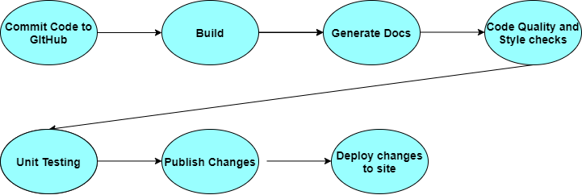

# CI/CD Pipeline

Our first focus while building our CI/CD pipeline was creating and familiarizing our team with a process to assure that pushes are contributing to our application rather than pushing code that would break our application. To do so, we first made main a protected branch so that it could not be deleted and so that it could not be pushed to directly. This assures that no accidental changes would be made directly, pushes and version authors can be more easily tracked and documented, and tasks can be associated to specific pull requests. This also assures that each change was worked on in a separate branch so that unfinished code can be pushed to the repository in a separate branch that would not affect the most up-to-date application. With one hundred percent uptime, any finished changes can be pushed and survived for functionality. This also makes sure that group members are not overriding each other's code. When everyone is forced to work on their own branches, they must resolve any conflicts when they create a pull request. This means that each group member must deal with any changes that have been made since their latest pull from main and will allow them to make changes function together rather than overriding them when pushing to main.

We then implemented Jekyll, a built-in feature for GitHub pages that builds a static website out of our repository with the changes that a person is attempting to merge and displays what our application would look and work like if we were to merge. This allows any group member to view their changes before they push them into main and permanently change our repository.

We created three files with HTML, CSS, and JS respectively, as a group, to set of rules for our group members to follow. This sets a uniform coding style for our group members to style to make sure our code is cohesive and easy to read.

The next thing we added to our repositories CI/CD pipeline was CodeFactor.io. This is an automated linter that tracks our repositories code quality with every push and commit to our main branch. It will not allow a group member to push to main if the code quality is not up to par with CodeFactor's requirements. It also provides a link to their website that specifies the issues in the new code which the person merging will have to fix before merging their changes into our main branch. We also use super linter to perform additional linting tasks to upkeep the style and quality of our codebase.

We then added JSDocs to our pipeline. JSDocs uses comments creating the keyword "JSDocs" to automatically create documentation for our code. This allows group members to stay up to date with our application and document their work easily while coding through comments.

Finally, we set up unit testing using Jest. This automatically runs unit tests against our code and does not allow a group member to push if their changes would cause our application to fail the tests. This is another tool that assures that group members are not pushing changes that cause our web application features to crash. We currently have the file for the unit tests set up as well as the GitHub action to automatically run said file; however, it currently does not have tests that runs against our application. One of our main goals for the upcoming week is to add as many tests as we can to assure our web application is functioning as we plan and that any last-minute changes do not cause our application to stop functioning as expected.

